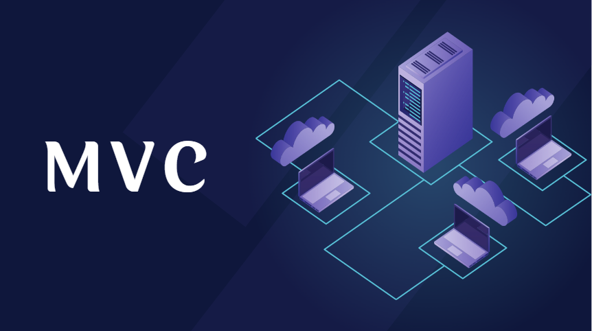

# Youtube-MVC
MVC Architectural Pattern Explanation Wit Practical Code Using PHP OOP and connecting with DB By PDO 

## Resources
- [MVC Architecture — Explanation](https://www.youtube.com/watch?v=GLvxgr-xtg8&list=PL71ekc7LvuXK7MZdFrZ0m_OIK1TnNdgAc)
- 
- [MVC Architecture — Slides](https://www.youtube.com/redirect?event=video_description&redir_token=QUFFLUhqbVl4TEh5VFA5V045bWtVdThjdWtxekVNZ0xoQXxBQ3Jtc0tubDJES25UUFFLZE5WT0JLQlhHdkgwXzlkWUhTZHBsYVgzLUppeXhweEs0NTNOV204RHhFVjJtMHBNRmFtTmdsWmhaRjB2b0hZRWxWRDAwYUxxWWVYM2JrY1NVZVJxR2FpbTBDRFZzZzJzRThvb1RmNA&q=https%3A%2F%2Fwww.canva.com%2Fdesign%2FDAF9LVkDwQw%2FSOwcTWpWs2TSfRmrFWBtBA%2Fedit%3Futm_content%3DDAF9LVkDwQw%26utm_campaign%3Ddesignshare%26utm_medium%3Dlink2%26utm_source%3Dsharebutton&v=8JaNRZLqrrA)

## Structure

### Entry Point
- `index.php`

### Core Files
- Route Class
- Database Class
- Request Class

### App Files
- Controllers
- Models
- Views
- QueryBuilder

## Notes
- Don't forget to change the database configuration in `database.php`

## Summary
- `index.php` is the entry point of the application
- `Route` class is responsible for routing the request to the appropriate controller
- `Database` class is responsible for connecting to the database
- `Request` class is responsible for handling the request
- `Controllers` are responsible for handling the request and returning the response
- `Models` are responsible for interacting with the database
- `Views` are responsible for displaying the data
- `QueryBuilder` is responsible for building the SQL queries
- `database.php` is responsible for storing the configuration of the database

